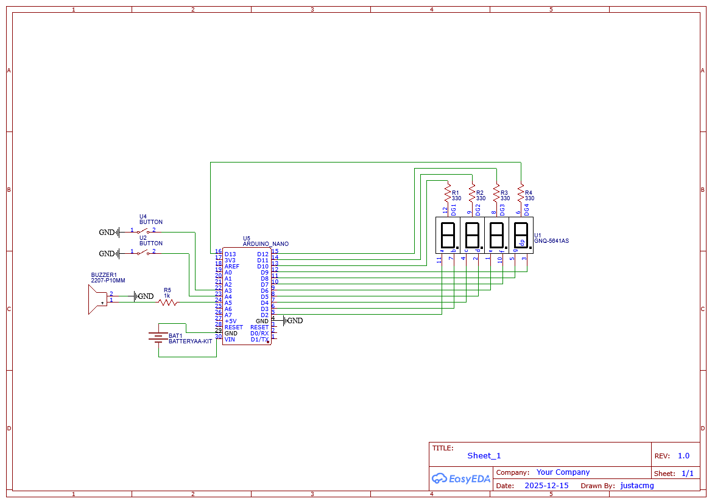

# Arduino 20-20-20 Rule

## What is this?

As someone who works in front of a computer all day and lesiures in front of a computer all day, I often
neglet the 20-20-20 rule. The 20-20-20 rule for those who are not aware, is that for every 20 minutes,
you should stare at an object 20 feet away for 20 seconds.

I wanted to create something to help me remember this, and yes there are sites (and probably websites) to
help with this. But I was like hey, I have an arduino kit lying around, I'd figure I'd try to learn some hardware stuff while I was at it.

Thus the creation of this project which takes an arduino device (I used an UNO R3, but a nano should work the same) and hooked it up to a
digital display, a buzzer, and some buttons. The pause button starts the timer, counting down from 20 minutes. After 20 minutes, the buzzer
will activate. Pressing the pause button again turns off the buzzer, and counts down from 20. Once the 20 hits 0, it buzzes again, and hitting the pause
button resets the cycle. You can also pause at any point by hitting the pause button. The reset button unsurprisngly resets the device to 0 essentially.

## How do I use this?

I used PIO to build and flash this onto my arduino. After that, just turn on the arduino with a power source of your choosing, and then hit the pause button.
You can also use the firmware.elf file that I uploaded in the release folder, that should be the right output of the PIO build process.

## Can't I just use a timer?

Yes. There's nothing I like more than hyper specialized devices though so that's why I made this.

## Is there a schematic for this?

Yes, sort of? I've never worked with schematics before so it's probably terrible and awful.

"why are you using those weird buttons/switches/parts?" Answer: Those were the parts I had from my kit and/or the parts available on EasyEDA so I could order it easily.

## What about a PCB?

The gerber files are created in the Schematic folder, you should be able to use that to order from your preferred PCB manufacturer.
Disclosure: I am NOT a PCB designer and this is literally the first PCB I've ever made, I haven't even tested it yet, these parts take a while
to come in. 
